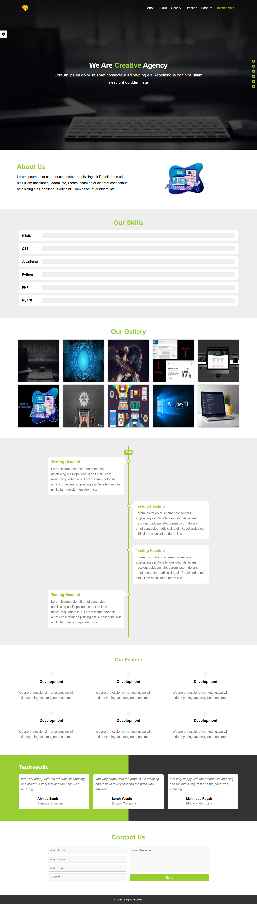
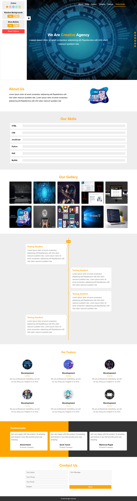
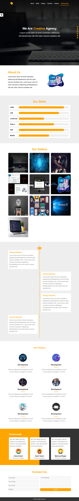

🧩 Special Design — Responsive Landing Page Template

🌐 Overview

Special Design is a modern, fully responsive landing page template built with HTML, CSS, and JavaScript.
It includes advanced customization features such as dynamic color themes, random background switching, smooth scrolling navigation, and an interactive image gallery with popup previews.

This template is ideal for creative agencies, freelancers, or anyone looking to showcase their portfolio or business elegantly.

---

🚀 Live Demo

👉 https://github.com/ahmednabil22224/Designify-Template

---

## 🌟 Lighthouse Report


| Metric            | Score |
| ----------------- | ----- |
| ⚡ Performance    | 100%  |
| ♿ Accessibility  | 96%   |
| 🛡️ Best Practices | 100%  |
| 🔍 SEO            | 100%  |

---

## 🧰 Tech Stack

- HTML5
- CSS3 (Grid & Flexbox Layouts)
- Font Awesome
- Responsive Design (Media Queries)
- js

---

## 🎯 Features

- Fully responsive across all devices (mobile, tablet, desktop)
- Smooth scroll and animated navigation bar
- Sticky header with auto height adjustment on scroll
- Interactive image overlay for apartments
- Active link highlighting based on scroll position
- Clean and modern UI design using CSS variables
- Accessibility-friendly structure and performance >95 in Lighthouse

---

```
## 🧩 File Structure

📁 Designify-Portfolio
│
├── 📁 css/
│ ├── normalize.css
│ ├── all.min.css
│ ├── fontawesome.min.css
│ └── style.css
│
├── 📁 js/
│ └── main.js
│
├── 📁 images/
│ ├── lighthouse-report.png
│ ├── (screenshot images)
│ └── (project images)
│
└── index.html
```

---

## 🚀 How to Run Locally

1. Clone this repository:

   ```bash
   git clone https://github.com/ahmednabil22224/Designify-Template.git

   ```

2. Open index.html in your browser.

## 📸 Preview

**Desktop View**



**Tablet View**


**Mobile View**

=======

---

## 🧰 Built With

- **HTML5**
- **CSS3 (Flexbox, Grid, Media Queries)**
- **Vanilla JavaScript (DOM Manipulation & Events)**

---
